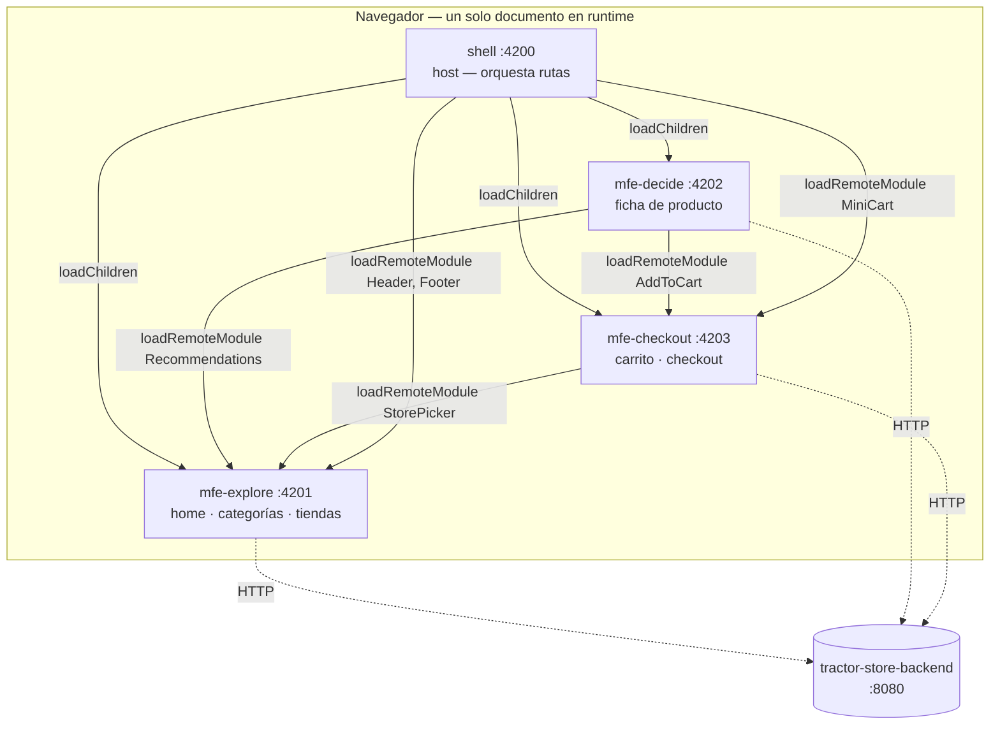

# tractor-store-frontend

Frontend de **The Tractor Store** (reto técnico Quind): tres micro-frontends independientes
(Explore, Decide, Checkout) compuestos en tiempo de ejecución por una shell app vía Module
Federation, consumiendo el backend del repo hermano `tractor-store-backend`. Sigue la
[especificación de negocio](https://micro-frontends.org/tractor-store/).

## Stack

Angular 19 (Standalone Components + Signals) · Nx 20 (monorepo integrado) · pnpm · Native
Federation (`@angular-architects/native-federation`, sobre el builder esbuild de Angular, sin
webpack) · TypeScript · TailwindCSS + Design Tokens · Storybook 9 · MSW 2 · Jest · Playwright.

## Arquitectura



Cada MFE es una app Angular completa, con su propio `main.ts`/`bootstrap.ts`, que puede
levantarse **standalone** (`nx serve mfe-explore`, puerto propio) o **compuesta** dentro del shell.
En modo compuesto, Module Federation resuelve todo dentro del mismo documento/origen del shell —
así es como un componente de un MFE puede injectarse dentro de la página de otro
(`AddToCart` de checkout dentro de la ficha de producto de decide, `StorePicker` de explore dentro
del checkout, `Header`/`Footer`/`MiniCart` compuestos por el propio shell).

- **Angular como singleton compartido**: cada `federation.config.js` declara
  `shareAll({singleton: true, strictVersion: true})` — verificado en vivo (ver
  [Rendimiento y bundle](#rendimiento-y-bundle) más abajo) que `@angular/core`, `@angular/router`,
  etc. se descargan **una sola vez** por sesión del navegador aunque los cuatro MFEs los usen.
- **Comunicación cross-MFE sin acoplar código**: un MFE nunca importa código fuente de otro
  directamente (`@nx/enforce-module-boundaries` lo bloquea). Se comunican de dos formas:
  - **Composición de UI**: `loadRemoteModule(...)` + `NgComponentOutlet` para embeber un
    componente de otro MFE (ver diagrama).
  - **Eventos de dominio**: `CustomEvent`s tipados en `shared-catalog` sobre `window`
    (`CART_ITEM_ADDED_EVENT`, `EXPLORE_STORE_SELECTED_EVENT`, `HTTP_ERROR_EVENT`) para que un MFE
    reaccione a algo que pasó en otro sin conocerlo (p. ej. el `MiniCart` del shell recarga el
    carrito cuando el `AddToCart` embebido en decide confirma una compra).
- **Estado con Signals** (no NgRx): cada MFE con estado propio sigue el patrón
  `Store` (signal privada) → `Selectors` (`computed()`) → `Actions` (llaman al `HttpClient`, mutan
  el `Store`) → `Facade` (lo único que inyectan componentes/resolvers).
- **Cada componente embebido corre en el injector de quien lo embebe**, no en el de su MFE de
  origen — por ejemplo, el `MiniCart` (código de checkout) que compone el shell usa el mismo
  injector/Router que las páginas de checkout cuando el shell las carga por ruta, pero el
  `AddToCart` embebido dentro de decide vive en el injector de decide. Por eso la sincronización
  del carrito entre ambos se hace con el evento `CART_ITEM_ADDED_EVENT`, no asumiendo estado en
  memoria compartido.

## Estructura del monorepo

```
apps/shell              # host: compone los tres MFEs vía Module Federation
apps/shell-e2e           # suite Playwright de punta a punta (levanta los 4 dev servers)
packages/mfe-explore     # equipo Explore: home, categorías, tiendas — expone Header/Footer/
                         # Recommendations/StorePicker
packages/mfe-decide      # equipo Decide: ficha de producto, selector de variantes
packages/mfe-checkout    # equipo Checkout: carrito, checkout — expone AddToCart/MiniCart
packages/shared-catalog  # modelos y CustomEvents de dominio compartidos (sin dependencias propias)
packages/ts-design-system # librería Angular de componentes (prefijo ts-, también exportable
                          # como Custom Elements — ver packages/mfe-explore/standalone-demo.html)
packages/design-tokens   # CSS Custom Properties en capas (primitivos/semánticos/componente)
packages/mock-api        # handlers MSW compartidos entre desarrollo sin backend y tests
```

Reglas de dependencia entre proyectos (`eslint.config.mjs`, `@nx/enforce-module-boundaries`): los
MFEs pueden depender de `shared-catalog`, `ts-design-system`, `design-tokens` y `mock-api`, pero
nunca entre ellos; `shell` puede depender de todos; `shared-catalog` no depende de nada.

## Cómo correrlo

```bash
pnpm install
pnpm serve:all        # las 4 apps a la vez, en puertos 4200-4203
npx nx serve shell    # o una app individual (standalone, sin los otros MFEs)
```

| App | Puerto |
| --- | --- |
| shell | 4200 |
| mfe-explore | 4201 |
| mfe-decide | 4202 |
| mfe-checkout | 4203 |

Por defecto todas las apps apuntan al backend real en `http://localhost:8080` (repo
`tractor-store-backend`, ver su propio README para levantarlo). **Para trabajar o probar sin
backend**, añade `?mock=1` a la URL del shell (o de cualquier MFE standalone):
`http://localhost:4200/?mock=1` — activa MSW con datos de muestra (`packages/mock-api`), incluido
un carrito y pedidos con estado real en memoria. `?mock=1&mockError=1` además fuerza que la
primera llamada falle con un 500, para ver el aviso de error en el header.

## Cómo testearlo

```bash
npx nx run-many --target=lint --all
npx nx run-many --target=test --all
npx nx run-many --target=build --all
npx nx affected --target=test        # solo lo que cambió, comparado contra origin/main
npx nx e2e shell-e2e                 # Playwright, levanta los 4 dev servers automáticamente
```

Los tests unitarios usan dos estilos según lo que conviene probar: la mayoría mockea el servicio
HTTP con `jest.fn()` (rápido, aislado); algunos (`*.msw.spec.ts` — una Store, un componente con
`HttpClient` y un resolver) usan `mock-api/node` (`msw`) para ejercitar el `HttpClient` real contra
una red interceptada, con los **mismos handlers** que el modo `?mock=1` del navegador.

`apps/shell-e2e` corre contra el **shell compuesto** (los 4 dev servers a la vez — antes solo
levantaba el shell, lo que rompía la composición en un entorno limpio). Cubre: el contrato Web
Component de `ts-button` (Shadow DOM + Custom Events vainilla), y el flujo completo home →
categoría → producto → variante → carrito → checkout → thanks contra `?mock=1` (sin backend real),
más el caso de error con un 500 simulado.

## Interceptores HTTP

Cada app tiene un único interceptor, `http-error.interceptor.ts` (duplicado a propósito en las 4
apps — es demasiado pequeño para justificar una librería compartida): loguea el error, dispara
`HTTP_ERROR_EVENT` en `window` (que el `Header` de explore, siempre compuesto en el shell, escucha
para mostrar un aviso visible) y vuelve a lanzar el error para que quien hizo la llamada también
pueda reaccionar. No hay un interceptor de autenticación: el carrito y los pedidos usan la cookie
de sesión del backend (`withCredentials: true` en esas llamadas específicas, no en las de
catálogo/inventario, que son públicas) en vez de un token que un interceptor tendría que adjuntar.
Si en el futuro hace falta más de un interceptor por app, el orden en `withInterceptors([...])`
importa porque cada uno envuelve al siguiente (como middleware): uno de auth iría primero (para que
el request ya tenga sus credenciales antes de que cualquier otro lo toque), y el de errores al final
del lado de ida / primero del lado de vuelta (ve la respuesta de todos los que corrieron antes).

## Rendimiento y bundle

Auditado en vivo (Playwright, build de producción, `nx build <app>` + los 4 dev servers) para el
hito de cierre del proyecto:

- **Angular no se duplica en runtime pese a que cada MFE lo trae en su propio `dist/`.** Cada
  build de cada MFE incluye su propia copia de `@angular/core`, `@angular/router`, etc. (~1 MB en
  total por app, necesario para que ese MFE funcione standalone) — pero se confirmó, contando las
  peticiones de red reales durante el flujo completo (home → categoría → producto → carrito →
  checkout, cruzando los 4 orígenes), que el navegador **descarga cada paquete compartido una sola
  vez** para toda la sesión: `@angular/core`, `@angular/common`, `@angular/router`,
  `@angular/forms`, `@angular/platform-browser` y `rxjs` aparecen exactamente 1 vez cada uno en el
  log de red, sin importar cuántos MFEs los usan. `shareAll({singleton: true})` está haciendo lo
  que promete.
- **Cada ruta carga como chunk separado, exactamente cuando se navega a ella** — confirmado
  registrando en qué paso del flujo aparece por primera vez cada chunk de página
  (`home-page.component`, `category-page.component`, `product-page.component`,
  `stores-page.component`): ninguno se descarga antes de que el usuario navegue a esa ruta.
- **Se encontró y corrigió un caso real de código no tree-shakeado**: `mock-api/browser` (MSW +
  handlers + datos de muestra, ~80 KB) se importaba de forma estática en el `bootstrap.ts` de las 4
  apps, así que se descargaba y ejecutaba en **todo** el tráfico real, aunque nadie usara `?mock=1`.
  Se cambió a un `import()` dinámico, condicionado a que el query param esté presente — verificado
  en vivo que sin `?mock=1` no se pide ningún archivo de `mock-api`, y que `?mock=1` lo sigue
  cargando y funcionando igual que antes.
- Los archivos `AddToCart-*.js`, `MiniCart-*.js`, `Header-*.js`, etc. (los módulos que cada MFE
  expone vía Module Federation) y el equivalente lazy-route del mismo componente para cuando ese
  MFE corre standalone son, a propósito, **dos artefactos compilados distintos con el mismo
  contenido** — Native Federation los construye por separado (uno para el grafo de "expuesto vía
  federación", otro para el grafo de "esta app sola"), así que un MFE puede exponer un componente Y
  seguir siendo desplegable de forma independiente sin que un modo dependa del otro.

## Design system y Storybook

```bash
pnpm storybook          # ts-design-system en modo interactivo
pnpm build-storybook    # build estático (storybook-static)
```

Los tokens de diseño viven en `packages/design-tokens` como CSS Custom Properties en tres capas
(primitivos, semánticos, de componente) y se comparten con Tailwind vía `tailwind.preset.js`. Los
componentes de `ts-design-system` (`ViewEncapsulation.ShadowDom`) se documentan con Storybook
(CSF v3) y también se registran como Custom Elements reales
(`packages/ts-design-system/src/lib/elements.ts`) para consumirse fuera de Angular — `mfe-explore`
además se compila entero como Custom Element standalone (target `custom-element`, ver
`packages/mfe-explore/standalone-demo.html`) como prueba de que ese contrato funciona sin el shell
ni Angular alrededor.

Para conectar regresión visual con Chromatic, exporta `CHROMATIC_PROJECT_TOKEN` (token del proyecto
en [chromatic.com](https://www.chromatic.com/)) y corre `pnpm chromatic`.

## Cómo desplegarlo

Las 4 apps son SPAs estáticas puras (sin SSR): el resultado de `nx build <app>` en
`dist/<app>/browser` se sirve con cualquier hosting de archivos estáticos con soporte de rutas SPA
(fallback a `index.html`) y CORS habilitado hacia los otros orígenes (Netlify, Vercel, un bucket S3
+ CloudFront, nginx con `try_files`, etc.) — `serve-static` en cada `project.json` usa
`@nx/web:file-server` como referencia local de ese mismo modo de servir. Cada app necesita
desplegarse en un origen propio y accesible desde los demás; el shell (`main.ts`) tiene hardcodeadas
las URLs de `remoteEntry.json` de los tres MFEs (`http://localhost:PORT` en desarrollo) — en
producción esas URLs deben apuntar a los dominios reales donde cada MFE termine publicado antes de
buildear el shell. El backend necesita `CORS_ALLOWED_ORIGINS` actualizado con esos mismos dominios
(ver README de `tractor-store-backend`).
